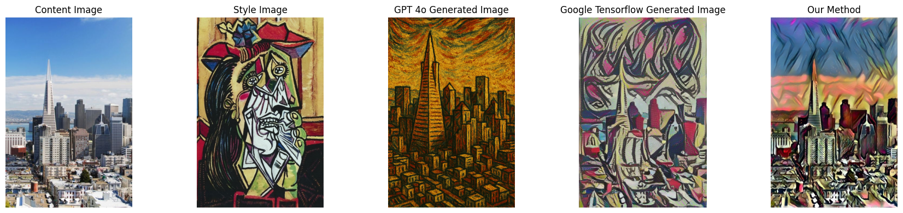
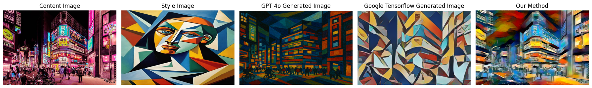
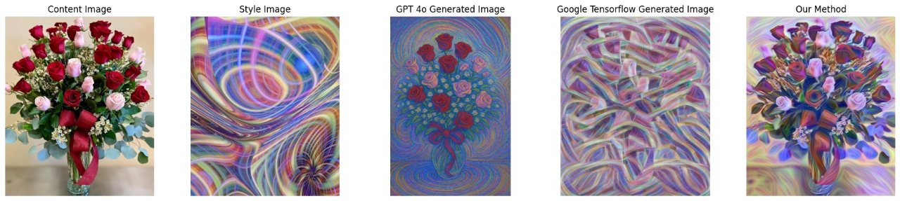
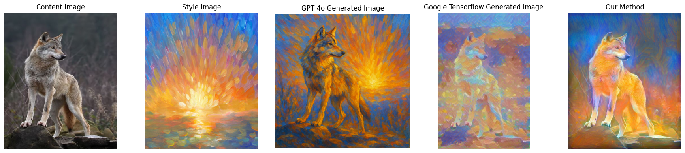

# 🎨 Realistic Neural Style Transfer Architecture That Addresses Limitations With Abstract Art Styles And Photographic Input

## 📌 Project Overview

This project proposes a refined neural style transfer (NST) architecture that improves upon traditional methods, particularly when applying abstract art styles to photographic content. Our approach emphasizes:

- Preserving the global structure and edges of the content image
- Transferring the high-level artistic tone and color distribution of the style image
- Reducing distortions common in patch-based or single-layer loss models

<div align="center">
  
  
  
  
</div>


## 🚀 Motivation

Traditional NST using style loss and content loss often breaks down when abstract or minimalistic art styles are applied to detailed photographs. These limitations arise due to:
- Weak patch correspondence
- Oversimplified content loss
- Lack of structural guidance

We address these issues by introducing:
- Multi-layer content loss
- Edge-aware loss functions (Laplacian, Sobel)
- Total Variation (TV) loss for noise suppression


| Component                           | Purpose                                       |
| ----------------------------------- | --------------------------------------------- |
| **Baseline VGG19** (TensorFlow Hub) | Produces initial stylisation and feature maps |
| **Multi‑Layer Content Loss**        | Matches high‑ and low‑level representations   |
| **Style Loss** (Gram matrices)      | Transfers global colour & texture             |
| **Sobel Edge Loss (ours)**          | Keeps straight edges & contours               |
| **Total Variation Loss**            | Removes high‑frequency noise                  |


---

## ⚙️ Implementation

- **Baseline Models**:  
  - TensorFlow with pre-trained VGG19 (via TensorFlow Hub)  
  - PyTorch with custom loss functions and VGG19  
- **Hardware**: CPU and A100 GPU via Google Colab  
- **Data**: Publicly available photographs and artworks (e.g., Picasso)

## ⚙️ Quick Start

1. **Clone & install dependencies**

   ```bash
   git clone https://github.com/Edward-H26/Realistic-Neural-Style-Transfer-Architecture.git
   cd Realistic-Neural-Style-Transfer-Architecture
   python -m venv .venv && source .venv/bin/activate  # optional
   pip install -r requirements.txt
   ```
2. **Prepare data** – place your content images and style images in `data/`.
3. **Run the notebook**

   ```bash
   jupyter notebook Result.ipynb
   ```

4. **Adjust hyper‑parameters** (`alpha`, `beta`, `gamma`, `delta`) in the notebook or via CLI flags to fine‑tune the trade‑off between content fidelity and stylisation.

> **Tip:** The default weights `α:1  β:60000  γ:20  δ:10` work well for most photographs. Increase `γ` for sharper edges or `δ` for smoother backgrounds.


## 📓 Notebook Walkthrough

We begin by loading a **Picasso painting** (style image) and a **skyline photo** (content image). Baseline outputs are generated using both Google's pre-trained NST model and an unmodified PyTorch VGG19 model.

### 🔍 Layer Inspection & Feature Engineering

- Visualized convolutional layers to determine their impact on stylization
- Created helper functions for:
  - Gram matrix computation
  - Feature extraction
  - Loss evaluations

### 🧠 Style and Content Layer Design

- **Content layer**: `conv_1` to `conv_5`
- **Style layers**: `conv_1` to `conv_5`

Initial experiments showed:
- Early layers (e.g., `conv_1`, `conv_2`) preserve structure
- Deeper layers (e.g., `conv_4`, `conv_5`) inject more stylistic features


### 🔧 Multi-Layer Content Loss
Captures both low-level textures and high-level structure:

$$
L_{\text{content}}^{\text{multilayer}}(\tilde{p}, \tilde{x}) = \sum_{l \in L} w_l \left(
\frac{1}{N_l M_l} \sum_{i=1}^{N_l} \sum_{j=1}^{M_l}
(F_{ij}^l - P_{ij}^l)^2
\right)
$$


### 🌀 Laplacian Edge Loss
Encourages edge sharpness using second-order derivatives:

$$
L_{\text{laplacian}}
= \frac{1}{CHW}
\sum_{c=1}^{C}\sum_{h=1}^{H}\sum_{w=1}^{W}  \bigl((\Delta\tilde{p})_{c,h,w} - (\Delta \tilde{x})  _{c,h,w} )^{2}
$$


### ➤ Sobel Edge Loss

Improves over Laplacian by capturing directional gradients:

$$
L_{\text{sobel}} = MSE(S_x(\tilde{p}), S_x(\tilde{x})) + MSE(S_y(\tilde{p}), S_y(\tilde{x}))
$$

Empirical results showed $L_{\text{sobel}}$ outperformed $L_{\text{laplacian}}$ in preserving straight lines and contours, especially in architectural scenes.

### 🌫️ Total Variation (TV) Loss

Suppresses high-frequency noise without blurring edges:

$$
L_{\text{tv}} = \sum [ (x_{h,w+1} - x_{h,w})^2 + (x_{h+1,w} - x_{h,w})^2 ]
$$

## 🔺 Final Total Loss Function

Our final formulation balances style, content, edge sharpness, and smoothness:

$$L_{\text{total}} =
\alpha \cdot L_{\text{content}} +
\beta \cdot L_{\text{style}} +
\gamma \cdot L_{\text{sobel}} +
\delta \cdot L_{\text{tv}}
$$


---

## 📈 Results

- Outperformed TensorFlow NST and ChatGPT-4o in structural preservation
- Better contour and edge clarity in abstract-to-photo transfers
- Cleaner and more coherent textures with reduced distortion

<div align="center">
  
</div>

---

## 🧪 Challenges & Key Learnings

- Single-layer content loss fails to capture fine-grained structure
- Laplacian loss improves sharpness, but lacks directional awareness
- Sobel loss + TV loss significantly boost photorealism and reduce noise

---
### 📚 **References**

- **BenHajyoussef & Saidani (2024)** – *Recent Advances on Image Edge Detection* [InTechOpen].  
  [View Paper (doi:10.5772/intechopen.1003763)](https://doi.org/10.5772/intechopen.1003763)

- **C. Lad (2019)** – *Understanding Neural Style Transfer* [Analytics Vidhya].  
  [Read on Medium](https://medium.com/analytics-vidhya/understanding-neural-style-transfer-3061cd92648)

- **Gatys et al. (2016)** – *Image Style Transfer Using Convolutional Neural Networks* [IEEE CVPR].  
  [View Paper (doi:10.1109/CVPR.2016.265)](https://ieeexplore.ieee.org/document/7780634)

- **Johnson et al. (2016)** – *Perceptual Losses for Real-Time Style Transfer and Super-Resolution* [ECCV].  
  [Read on arXiv](https://arxiv.org/abs/1603.08155)

- **Kotiyal et al. (2021)** – *Neural Style Transfer with Structure Preservation of Content Image* [IJERT].  
  [View Paper (doi:10.17577/IJERTCONV9IS07032)](https://www.ijert.org/neural-style-transfer-with-structure-preservation-of-content-image)

- **Liu et al. (2023)** – *Coarse-to-Fine Structure-Aware Artistic Style Transfer* [Applied Sciences].  
  [View Paper (doi:10.3390/app13020952)](https://doi.org/10.3390/app13020952)

- **P. Baheti (2021)** – *Neural Style Transfer: Everything You Need to Know* [V7 Labs Blog].  
  [Read the Guide](https://www.v7labs.com/blog/neural-style-transfer)

- **R. Fisher et al. (2003)** – *Laplacian of Gaussian – Spatial Filters*.  
  [View Online](https://homepages.inf.ed.ac.uk/rbf/HIPR2/log.htm)

- **Reimann et al. (2022)** – *Controlling Strokes in Fast Neural Style Transfer Using Content Transforms* [The Visual Computer].  
  [View Paper (doi:10.1007/s00371-022-02518-x)](https://doi.org/10.1007/s00371-022-02518-x)

- **Seif & Androutsos (2018)** – *Edge-Based Loss Function for Single Image Super-Resolution* [ICASSP].  
  [View Paper (doi:10.1109/ICASSP.2018.8461664)](https://doi.org/10.1109/ICASSP.2018.8461664)

- **T. Malche (2024)** – *Edge Detection in Image Processing: An Introduction* [Roboflow Blog].  
  [Read the Blog](https://blog.roboflow.com/edge-detection/)

- **X. Wang (2007)** – *Laplacian Operator-Based Edge Detectors* [IEEE TPAMI].  
  [View Paper (doi:10.1109/TPAMI.2007.1027)](https://doi.org/10.1109/TPAMI.2007.1027)

- **Zhang et al. (2021)** – *Dive into Deep Learning* [arXiv].  
  [Read on arXiv](https://arxiv.org/abs/2106.11342)


---

> For code and experiments, see the `TestingProposedMethods.ipynb` notebook.
